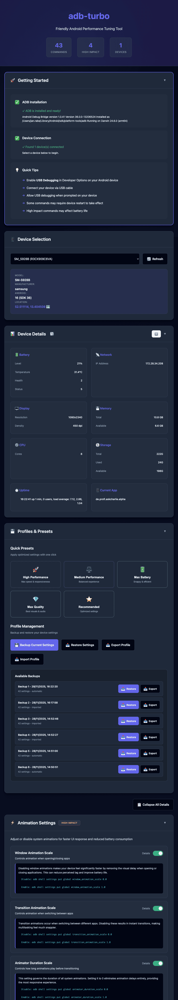
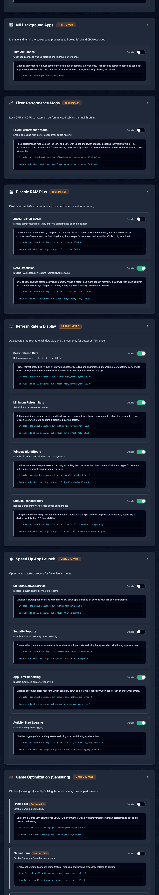
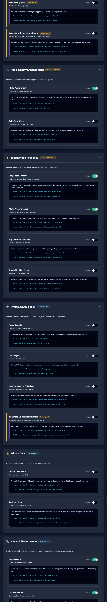

# adb-turbo

[](https://github.com/kibotu/adb-turbo/actions/workflows/test.yml)
[](https://github.com/kibotu/adb-turbo/actions/workflows/deploy-pages.yml)

> Speed up your Android device with confidence

A friendly web tool with 43 carefully curated ADB commands to improve your Android device's performance—no root required, no complicated setup.

## Quick Start

Getting started is easy! Just run:

```bash
./run.sh    # macOS/Linux
run.bat     # Windows
```

The server will start at **http://localhost:8765** and automatically open in your browser.

**To stop the server:** Simply press `Ctrl+C`

## 🎭 Live Demo

Want to see what adb-turbo looks like before installing? Check out our **[live demo on GitHub Pages](https://kibotu.github.io/adb-turbo/)**!

**Note**: The demo is a preview version that showcases the interface. To use adb-turbo with real Android devices, you'll need to run it locally.

<table>
  <tr>
    <td width="33%">
      <a href="docs/screenshot_part1.png">
        
      </a>
    </td>
    <td width="33%">
      <a href="docs/screenshot_part2.png">
        
      </a>
    </td>
    <td width="33%">
      <a href="docs/screenshot_part3.png">
        
      </a>
    </td>
  </tr>
</table>

## What It Does

This tool makes Android performance optimization accessible to everyone. We've organized 43 ADB commands into 13 categories by their impact level:

### High Impact
- **Animation Settings** (3 commands) - Disable UI animations for snappier response
- **Background Processes** (1 command) - Clear caches and free up RAM
- **Fixed Performance Mode** (1 command) - Lock CPU/GPU to maximum (note: may warm up your device)
- **RAM Plus** (2 commands) - Disable virtual RAM expansion

### Medium Impact
- **Display & Refresh Rate** (4 commands) - Fine-tune refresh rate, blur, and transparency
- **App Launch Speed** (4 commands) - Help apps start up faster
- **Game Optimization** (4 commands) - Disable Samsung throttling (for Samsung devices)
- **Audio Quality** (2 commands) - Enable K2HD and Tube Amp effects for richer sound
- **Touchscreen Response** (4 commands) - Reduce touch latency for better responsiveness

### Low Impact
- **System Optimization** (4 commands) - Helpful CPU/GPU rendering tweaks
- **Private DNS** (2 commands) - Configure DNS for enhanced privacy
- **Network Performance** (7 commands) - WiFi and cellular optimizations
- **Power Management** (5 commands) - Battery and sleep settings

**What makes it different?**
- **Visual and intuitive** - See what each command does before you run it
- **Reversible** - Toggle any setting back with a single click
- **Transparent** - Every command is clearly explained, no magic
- **Safe to explore** - Start with low-impact tweaks and work your way up

### 💾 Profiles & Presets

Apply optimized settings with one click:

- 🚀 **High Performance** - Maximum speed for gaming (disables animations, max CPU/GPU)
- ⚖️ **Medium Performance** - Balanced daily use (adaptive settings)
- 🔋 **Max Battery** - Extended battery life (power-saving mode)
- ⭐ **Recommended** - Optimized overall experience (our suggested settings)

**Profile Management:**
- 💾 **Backup** - Save your current device settings
- 📥 **Restore** - Revert to any previous backup
- 📤 **Export** - Share your configuration as a JSON file
- 📥 **Import** - Load configurations from others

**Features:**
- Settings persist across server restarts and device reconnections
- Automatic backup when applying presets
- Up to 10 backups per device
- Device-specific profiles (based on manufacturer + model)

**Testing with SmolChat App:**

We tested the profiles using the [SmolChat-Android](https://github.com/shubham0204/SmolChat-Android) to measure their impact on token count for local LLMs:

<table>
  <tr>
    <td width="50%" align="center">
      <strong>🚀 High Performance Profile</strong><br>
      <a href="docs/high-performance.gif">
        
      </a>
      <em>Maximum speed for gaming and intensive tasks</em>
    </td>
    <td width="50%" align="center">
      <strong>⭐ Default Settings Profile</strong><br>
      <a href="docs/default-settings.gif">
        
      </a>
      <em>Balanced performance for everyday use</em>
    </td>
  </tr>
</table>


## Requirements

You'll need just a few things to get started:

- **Python 3.10+**
- **ADB (Android Debug Bridge)** - [we'll help you install it below](#installing-adb)
- **UV package manager** - don't worry, our run scripts will install it automatically if needed
- **Android device** with USB debugging enabled

## Installing ADB

**macOS:**
```bash
brew install android-platform-tools
```

**Linux (Debian/Ubuntu):**
```bash
sudo apt install android-tools-adb
```

**Windows:**

Download [Android SDK Platform Tools](https://developer.android.com/studio/releases/platform-tools) and add to PATH.

**Verify installation:**
```bash
adb version
```

## Setup Your Device

1. **Enable Developer Mode:**
   - Go to Settings → About Phone
   - Tap "Build Number" 7 times
   - You'll see "You are now a developer!"

2. **Enable USB Debugging:**
   - Go to Settings → Developer Options
   - Enable "USB Debugging"

3. **Connect & Authorize:**
   - Connect your device via USB
   - Accept the "Allow USB debugging?" prompt on your device
   - Check the "Always allow from this computer" box

4. **Verify Connection:**
   ```bash
   adb devices
   ```
   You should see your device listed.

## Usage

Using the tool is straightforward:

1. Run the application with `./run.sh` or `run.bat`
2. Select your device from the dropdown
3. Browse through command categories organized by impact level
4. Toggle commands on/off with a single click
5. View real-time command output and current states

Your preferences are automatically saved and will be there when you come back!

## Important Notes

⚠️ **Please use responsibly:**
- These optimizations can affect battery life and device stability
- Some commands (like Fixed Performance Mode) may cause your device to warm up
- We recommend understanding what each command does before using it
- Some changes may need a device reboot to take full effect
- Good news: you can always re-enable settings through the interface!

⚠️ **Device compatibility:**
- Most commands work great on Android 5.0+ (API level 21+)
- Samsung-specific commands are clearly marked for your convenience
- Results may vary across different devices and Android versions
- Manufacturer skins (One UI, MIUI, etc.) might behave a bit differently

## Troubleshooting

### Connection Issues

**No devices found?**
- Double-check that your USB cable is properly connected
- Make sure USB debugging is enabled in Developer Options
- Accept the debugging authorization prompt on your device
- Try running `adb devices` in your terminal to verify the connection
- Sometimes a different USB cable or port can help
- On Linux, you might need to set up udev rules for your device

**ADB not found?**
- Follow our [installation instructions above](#installing-adb)
- Make sure ADB is in your system PATH
- Try restarting your terminal after installation
- On Windows, you may need to manually add the platform-tools directory to your PATH

**Can't Connect ADB**
- Try different cable/port, verify USB debugging enabled
- Restart ADB server: `adb kill-server && adb start-server`
- Restart device
- Check USB connection mode (should be "File Transfer" or "PTP")
- On Linux: Check udev rules

**Port 8765 already in use?**
```bash
./cleanup.sh              # macOS/Linux
pkill -f "python.*app.py" # Manual cleanup
```

### Command & Settings Issues

**Command failed or no effect?**
- Check the console output for helpful error messages
- Some commands require specific Android versions (API level)
- Samsung-specific commands are designed for Samsung devices only
- Some settings may need a device reboot to take full effect
- Try running the command manually via `adb shell` to see what's happening

**Settings Not Working**
- Verify setting applied: `adb shell settings get [namespace] [key]`
- Output `null` means not supported on device
- Check compatibility matrix in documentation
- Restart device if setting requires reboot
- Accept that some settings are device-specific (expected with Android fragmentation)

**Settings Reset After Reboot**
- Some settings don't persist by design
- `setprop` commands are temporary, use `settings put` for persistence
- Manufacturer updates may re-enable features
- Use adb-turbo profiles to quickly re-apply settings

**Permission denied errors?**
- Make sure USB debugging is properly authorized
- Some commands may not work on all devices or Android versions
- Manufacturer-specific restrictions might apply

### Performance Issues

**Device Too Hot**
- Disable Fixed Performance Mode immediately
- Revert to 60Hz or adaptive refresh rate
- Re-enable thermal management (Samsung GOS if disabled)
- Allow device to cool before further use
- Performance modes generate heat (expected trade-off)

**Battery Draining Fast (>30% faster than baseline)**
- Revert to Max Battery profile or baseline settings
- Check refresh rate (120Hz constant drains battery)
- Re-enable WiFi power save
- Disable Fixed Performance Mode
- Review battery stats: Settings → Battery → Battery Usage

**Device Laggy After Changes**
- Re-enable ZRAM if device has <8GB RAM
- Check device temperature (thermal throttling?)
- Review app background restrictions
- Revert to baseline settings
- Apply changes individually to identify cause
- Disabled ZRAM on low-RAM devices causes performance issues

**Apps Reloading Frequently**
- Re-enable ZRAM: `adb shell settings put global zram_enabled 1`
- Re-enable RAM Plus (Samsung): `adb shell settings put global ram_expand_size_list [original_value]`
- Monitor multitasking behavior
- Only disable ZRAM on devices with 8GB+ RAM

### App Issues

**Apps Crashing or Misbehaving**
- Revert recent changes through backup/restore
- Clear app cache: Settings → Apps → [App] → Clear Cache
- Restart device
- Test app behavior after revert
- Reinstall problematic apps if issue persists
- Test with non-critical apps first, one change at a time

**Banking/Payment Apps Not Working**
- Revert all settings to baseline (SafetyNet/Play Integrity checks)
- Clear Google Play Services cache
- Restart device
- Test banking apps after revert
- Check Play Integrity: Download "Play Integrity API Checker" from Play Store
- Factory reset if issue persists (last resort)
- Always test banking apps after any system changes

**System UI Crashed**
- Restart device (hold power button, select restart)
- If device won't restart: Hold power button for 10+ seconds (force restart)
- After restart: Immediately revert all changes through adb-turbo
- Boot into Safe Mode if needed: Hold power → Long press "Power Off" → Boot to Safe Mode

### Emergency Recovery

**Quick Revert to Baseline**

1. **adb-turbo backup/restore** (recommended)
   - Use backup/restore feature in adb-turbo interface
   - Fastest and safest method
   - Restores exact previous state

2. **Reset app preferences** (partial)
   - Settings → System → Reset Options → Reset app preferences
   - Resets some settings (not comprehensive)

3. **Factory reset** (last resort)
   - Settings → System → Reset → Factory data reset
   - ⚠️ **WARNING:** Erases all data - backup first!
   - Only if other methods fail

### Getting Help

**Before Requesting Help:**
1. Revert to baseline settings
2. Restart device
3. Test in safe mode (isolates system vs. app issues)
4. Document exact changes made
5. Check if issue is device-specific or reproducible

**Opening a GitHub Issue:**

Search existing issues first: [github.com/kibotu/adb-turbo/issues](https://github.com/kibotu/adb-turbo/issues)

When opening a new issue, include:
- ✅ Device manufacturer and model
- ✅ Android version and build number
- ✅ Specific settings/commands that caused issues
- ✅ Steps to reproduce
- ✅ Expected vs. actual behavior
- ✅ ADB output (if relevant)
- ✅ Current device state (accessible normally, safe mode, etc.)

Still stuck? Feel free to open an issue on GitHub – we're happy to help!

---

## Advanced

### Manual Installation

Prefer to do things manually? No problem! Here's how:

```bash
# Install UV package manager
curl -LsSf https://astral.sh/uv/install.sh | sh

# Install dependencies
uv sync

# Run the application
uv run python app.py
```

Want to learn more about UV? Check out [docs.astral.sh/uv](https://docs.astral.sh/uv/)

### Configuration

You can customize the application using environment variables if needed:

| Variable | Default | Description |
|----------|---------|-------------|
| `ADB_HOST` | `0.0.0.0` | Server host address |
| `ADB_PORT` | `8765` | Server port number |
| `DEBUG` | `False` | Enable debug mode |
| `LOG_LEVEL` | `INFO` | Logging level (DEBUG, INFO, WARNING, ERROR, CRITICAL) |
| `LOG_FILE` | `None` | Optional log file path |
| `ADB_TIMEOUT` | `30` | ADB command timeout in seconds |
| `CORS_ORIGINS` | `*` | CORS allowed origins |

**Example:**
```bash
export ADB_PORT=9000
export LOG_LEVEL=DEBUG
export LOG_FILE=adb_optimizer.log
./run.sh
```

### API Reference

For developers who want to integrate with the tool, we provide a clean REST API with standardized JSON responses:

#### Response Format

All API responses follow this standardized format:

**Success Response:**
```json
{
  "success": true,
  "data": { /* response data */ },
  "timestamp": "2025-11-28T12:00:00.000Z"
}
```

**Error Response:**
```json
{
  "success": false,
  "error": "Error message",
  "details": { /* optional error details */ },
  "timestamp": "2025-11-28T12:00:00.000Z"
}
```

#### Endpoints

```
GET  /                          # Web interface
GET  /api/check-adb             # Verify ADB installation
GET  /api/devices               # List connected devices
GET  /api/device-info/<id>      # Get device details
GET  /api/categories            # Get all command categories
GET  /api/command-states/<id>   # Get current command states
POST /api/execute               # Execute a command
POST /api/get-setting           # Get current setting value

# Profiles & Presets API
POST /api/profiles/backup       # Backup current device settings
POST /api/profiles/restore      # Restore from backup
POST /api/profiles/list         # List all backups for device
POST /api/profiles/export       # Export a backup as JSON
POST /api/profiles/import       # Import a profile
GET  /api/profiles/presets      # Get available presets
POST /api/profiles/apply-preset # Apply a preset configuration
```

#### Example API Usage

**Check ADB availability:**
```bash
curl http://localhost:8765/api/check-adb
```

**List devices:**
```bash
curl http://localhost:8765/api/devices
```

**Execute a command:**
```bash
curl -X POST http://localhost:8765/api/execute \
  -H "Content-Type: application/json" \
  -d '{
    "device_id": "your_device_id",
    "command": "shell settings put global window_animation_scale 0.0",
    "action": "disable"
  }'
```

### Security Features

We take security seriously and have built in several protections:

- **Command Injection Prevention**: Uses list-based subprocess calls instead of shell execution
- **Input Validation**: All API inputs are validated before processing
- **Timeout Protection**: ADB commands have configurable timeouts to prevent hanging
- **CORS Configuration**: Configurable CORS origins for added security

### Logging

The application includes helpful logging to make debugging easier:

```python
# Logs are written to console by default
# You can configure a log file via environment variable
export LOG_FILE=adb_optimizer.log
export LOG_LEVEL=DEBUG
```

### Testing

We've included a comprehensive test suite to help ensure everything works as expected:

```bash
# Install development dependencies
uv sync --group dev

# Run all tests
uv run pytest

# Run tests with coverage report
uv run pytest --cov

# Run specific test file
uv run pytest tests/test_adb_commands.py

# Run tests matching a pattern
uv run pytest -k "test_execute"
```

### Tech Stack

- **Backend:** Python 3.10+, Flask 3.0+, Flask-CORS 4.0+
- **Frontend:** Vanilla JavaScript, HTML5, CSS3
- **Tools:** Android Debug Bridge (ADB), UV package manager
- **Testing:** pytest, pytest-cov
- **Design:** Responsive, mobile-first, accessible

## Design Philosophy

**adb-turbo** is built on three core principles: accessibility, transparency, and education.

### Accessibility
We make Android's internal settings accessible to everyone—not just command-line experts. The tool provides:
- Organized, searchable interface for scattered ADB commands
- Clear categorization by impact and safety level
- One-click profiles for common scenarios
- Easy reversibility for safe experimentation

### Transparency
No hidden behavior, no magic optimizations. Every action shows:
- Exact ADB command being executed
- Target namespace and setting
- Expected effect and trade-offs
- Compatibility information
- Manufacturer-specific notes

You maintain full control and understanding of what happens on your device.

### Education
Understanding Android's internal settings is valuable for:
- App developers optimizing for different device configurations
- Technical leads evaluating device performance characteristics
- QA teams testing under various system settings
- Power users customizing their devices

This tool is for learning, testing, and informed optimization—not guaranteed performance gains. Results vary by device, and understanding trade-offs is essential.

## Roadmap & Community

### Planned Features

**Configuration Management:**
- ✨ Custom profile creation and saving
- ✨ Profile export/import for team sharing
- ✨ Configuration versioning and comparison

**Compatibility & Safety:**
- ✨ Device compatibility detection (warn about unsupported commands)
- ✨ Pre-execution command validation
- ✨ Enhanced device information display
- ✨ Compatibility database from community testing

**Measurement & Analysis:**
- ✨ Benchmark integration for objective results
- ✨ Before/after comparison metrics
- ✨ Battery and performance tracking

**Advanced Features:**
- Context-aware profile switching (battery level, app usage)
- Per-app performance profiles
- Community-contributed command categories (peer-reviewed)
- Integration with CI/CD for automated device configuration

### Community Contributions

**Testing & Validation:**
- Test on different devices and Android versions
- Document compatibility findings
- Share benchmark results and measurements
- Validate settings behavior on various manufacturers

**Documentation & Education:**
- Improve command explanations
- Add use case examples
- Translate for international community
- Create video tutorials

**Development:**
- Add new commands with documentation
- Improve UI/UX
- Build integrations (CI/CD, testing frameworks)
- Contribute compatibility data

Education and transparency remain core values. Understanding Android internals is as valuable as the optimizations themselves.

## Contributing

Contributions are warmly welcomed! Whether you're fixing a bug, adding a feature, or improving documentation, your help makes this tool better for everyone. 🙌

1. Fork the repository
2. Create a feature branch
3. Make your changes
4. **Run tests**: `uv run pytest`
5. Test with real devices
6. Submit a pull request

Every contribution, no matter how small, is appreciated! 💙

## Credits

This project was inspired by [Technastic's excellent ADB Commands Guide](https://technastic.com/adb-commands-improve-performance-android/).

**Made with ❤️ by [kibotu](https://github.com/kibotu) for the Android developer community.**

A heartfelt thank you to all contributors who help make this tool better with each update!


## License

```
Copyright 2025 Jan Rabe & CHECK24

Licensed under the Apache License, Version 2.0 (the "License");
you may not use this file except in compliance with the License.
You may obtain a copy of the License at

   http://www.apache.org/licenses/LICENSE-2.0

Unless required by applicable law or agreed to in writing, software
distributed under the License is distributed on an "AS IS" BASIS,
WITHOUT WARRANTIES OR CONDITIONS OF ANY KIND, either express or implied.
See the License for the specific language governing permissions and
limitations under the License.
```

---

<div align="center">

**Questions or issues?** Open an issue on GitHub – we're here to help! 🤝

**Found this useful?** Give it a ⭐ to help others discover it!

**Happy optimizing!** 🚀

</div>
